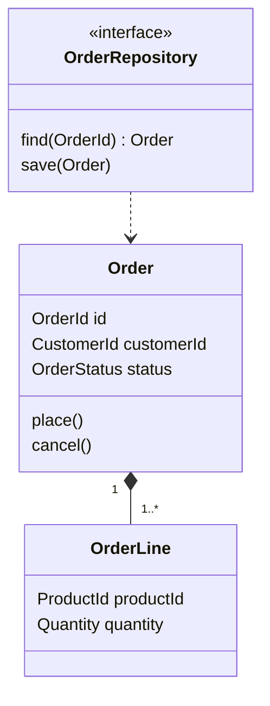
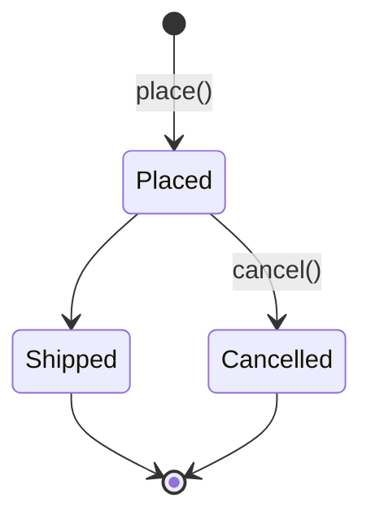

# 「設計」節に描くドメイン図の書式

issue 本文の「設計」節を、用語集の言葉で描くときの書式である。
節の位置と図の種類の選び方は github-convention の ISSUE-FORMAT.md に従い、ここでは繰り返さない。

## 節の構造

````md
## 設計

{1〜2 文: この図が何を、どの範囲で表すか}

```mermaid
{図}
```

{図から読み取れないこと。この issue で足す部分と既存の部分の区別、描かなかった範囲とその正本、判断の理由}
````

観点が複数あるなら、`###` の小見出しで図を分け、それぞれに同じ構造を繰り返す。

## 例

````md
## 設計

### 注文の集約

注文を一つの単位として読み書きするときに、まとめて扱うものと、その境界を表す。



`Order` と `OrderRepository` は既存で、この issue で足すのは `cancel()` と `OrderLine` である。
明細を注文の外から参照させない理由は「決定」の比較表を参照。
`Customer` は `CustomerId` で参照するだけで、この集約には含めない。

### 注文の状態遷移



`Shipped` から先の遷移は Fulfillment コンテキストが持つ（正本は `CONTEXT-MAP.md`）。
`Shipped` 後のキャンセルを許すかは「実装時に決めること」に残している。
````

## ルール

- **ノードの名前は用語集に従う。** コード上の識別子を使い、用語集に日本語の正式用語があるなら、ラベルを書ける図では `注文 (Order)` のように用語集と同じ形で併記する。用語集に無い概念をノードにしたくなったら、先に用語集へ足すか、載せない一般的なプログラミング概念（リポジトリ、ハンドラなど）かを判断する。後者は `OrderRepository` のように用語との組み合わせで名付ける。
- **描くのは「決定」に入った構造だけにする。** 「実装時に決めること」に残した構造は描かず、文で示す。
- **パターン名をノードにしない。** 集約ルート、リポジトリ、ドメインイベントといったパターンが決める役割は、`<<interface>>` や `*--` のような図の記法と、用語との組み合わせの名前で表す。どのパターンを採ったかとその理由は「決定」にあるので、図の後の文からは参照だけを置く。
- **一つの図には一つの観点だけを描く。** 構造、処理の流れ、状態遷移を一つの図に混ぜず、小見出しで分ける。
- **既存の部分とこの issue で足す部分は文で区別する。** 色分けや凡例で区別しない。図の意味が凡例無しで読めないなら、図を分けるかノード名を見直す。
- **図の後の文には、図だけでは読み取れないことだけを書く。** 用語の定義は用語集に、判断の理由と比較は「決定」に、ADR の条件を満たす決定は ADR にあるので、文には書かず参照だけを置く。
